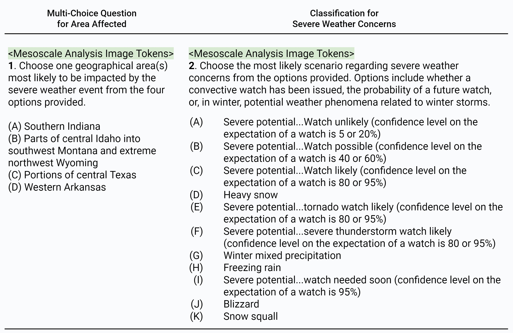

# WeatherQA Dataset Description
WeatherQA is the first multimodal dataset designed for machines to reason about complex combinations of weather parameters and predict severe weather in real-world scenarios.\
Link to the paper: [WeatherQA: Can Multimodal Language Models Reason about Severe Weather?](https://arxiv.org/abs/2406.11217)

Each entry of WeatherQA includes:
- A set of 20 images from the [Mesoscale Analysis Archive](https://www.spc.noaa.gov/exper/ma_archive/)
- An annotation from [Mesoscale Discussion](https://www.spc.noaa.gov/products/md/) describing the weather conditions and potential severe weather threats
- The data is licensed under the copyright of [NOAA](https://www.noaa.gov/)


## WeatherQA Dataset

[Link to WeatherQA Dataset](https://drive.google.com/file/d/1Fwj0ISh-20E7KfHuho9TPwNbgkJ7rGOJ/)

#### Example of a Sample in the WeatherQA Dataset

```json
{
  "2018_md0398": {
    "para_paths": [
      "./md_image/2018/shr6/md0398_20180513_17_shr6.gif",
      "./md_image/2018/scp/md0398_20180513_17_scp.gif",
      "./md_image/2018/tadv/md0398_20180513_17_tadv.gif",
      "./md_image/2018/lclh/md0398_20180513_17_lclh.gif",
      "./md_image/2018/epvl/md0398_20180513_17_epvl.gif",
      "./md_image/2018/laps/md0398_20180513_17_laps.gif", 
      "./md_image/2018/mcsm/md0398_20180513_17_mcsm.gif",
      "./md_image/2018/rgnlrad_cropped/md0398_20180513_17_rgnlrad.gif",
      "./md_image/2018/mcon/md0398_20180513_17_mcon.gif",
      "./md_image/2018/ttd/md0398_20180513_17_ttd.gif",
      "./md_image/2018/thea/md0398_20180513_17_thea.gif",
      "./md_image/2018/swbt/md0398_20180513_17_swbt.gif",
      "./md_image/2018/stor/md0398_20180513_17_stor.gif",
      "./md_image/2018/lllr/md0398_20180513_17_lllr.gif",
      "./md_image/2018/srh1/md0398_20180513_17_srh1.gif",
      "./md_image/2018/bigsfc_cropped/md0398_20180513_17_bigsfc.gif",
      "./md_image/2018/effh/md0398_20180513_17_effh.gif",
      "./md_image/2018/sbcp/md0398_20180513_17_sbcp.gif",
      "./md_image/2018/fzlv/md0398_20180513_17_fzlv.gif",
      "./md_image/2018/pchg/md0398_20180513_17_pchg.gif"
    ],
    "annotations": "Areas affected...portions of southeast OH...northern WV including Panhandle...western MD...southwest PA...northwest VA Concerning...Severe potential...Watch possible Probability of Watch Issuance...60 percent SUMMARY...Isolated to widely scattered thunderstorms may develop this afternoon and move southeast, with a risk for large hail and damaging winds. A tornado or two will also be possible.  A Severe Thunderstorm Watch may be needed prior to 20Z/4 pm EDT.",
    "time": "05 / 13, 17UTC"
  }
}
```
#### Notes:
- **Key (e.g., "2018_md0398")**: This is a unique identifier for the Mesoscale Discussion sample, which includes the year and a serial number.
- **para_paths**: An array of strings, each representing the file path to a weather parameter image. There are 20 image paths in total, each corresponding to different weather parameters.
- **annotations**: A string containing a detailed description of the weather conditions and potential severe weather threats. This includes information about the affected areas, the severe weather potential, and the probability of watch issuance.
- **time**: A string representing the date and time of the weather parameter images entry in UTC converted from time of issuance in the Mesoscale Discussion sample.

### Mesoscale Analysis Dataset (md_image)

[2020 Mesoscale Analysis Dataset](https://drive.google.com/file/d/1DGKiHCdMtoksymuA1OGe5d9dEiK4AvQR/view?usp=drive_link) roughly 1.5GB \
[2014-2019 Mesoscale Analysis Dataset](https://drive.google.com/file/d/1mViaf1f-sWB1DyfCrw-NwmZp4gj96mYr/view?usp=drive_link) roughly 10GB

The Mesoscale Analysis Dataset contains 20 images, including:
- 18 ingredients-based weather parameter images
- One surface observation image
- One composite radar reflectivity image

The dataset is stored in the `md_image/` directory and is organized by:
1. Year (e.g., `2020/`, `2019/`)
2. Weather parameters or ingredients within each year

Each image file follows the naming convention:
```
md<serial_number>_<date_yyyymmdd>_<hour_hh_utc>_<parameter_name>.gif
```

#### Directory Structure

```
md_image/
    ├── 2020/
    │   ├── bigsfc_cropped/
    │   │   └── md0050_20200112_06_bigsfc.gif
    │   │       ...
    │   ├── epvl/
    │   │   └── md0050_20200112_06_epvl.gif
    │   │       ...
    │   ├── lllr/
    │   │   └── md0050_20200112_06_lllr.gif
    │   │       ...
    │   └── rgnlrad_cropped/
    │       └── md0050_20200112_06_rgnlrad.gif
    │           ...
    │       ...    
    └── 2019/
        ├── bigsfc_cropped/
        │   └── md0825_20190525_06_bigsfc.gif
        │        ...
        ├── epvl/
        │   └── md0825_20190525_06_epvl.gif
        │        ...
        ├── lllr/
        │   └── md0825_20190525_06_lllr.gif
        │        ...
        └── rgnlrad_cropped/
            └── md0825_20190525_06_rgnlrad.gif
                ...
            ...
        ...
```

#### Notes:
- Each year directory (e.g., `2020/`, `2019/`) contains subdirectories for different weather parameters.
- Each parameter directory contains image files named according to the specified convention.


## Test Dataset Structure
The provided test dataset structure includes the necessary prompt inputs for the multimodal models.
The dataset is designed to help interpret comprehensive figures related to severe weather analysis and forecasting. It includes the following key components:

- **sys_prompt**: The system prompt or instructions provided to the AI assistant.
- **prompt_template**: A template or format for the prompt.
- **para_description**: A short description of the weather parameters being analyzed.
- **samples**: Test data samples

Test Dataset Download Links:
- [Direct](https://drive.google.com/file/d/13aKfHdXrPY12zaNhPGLfd1GLia-DwNel/view?usp=sharing)
- [CoT](https://drive.google.com/file/d/1TNnjlXhK9L6zbNrNqGWf7Zxw0JO_fHb2/view?usp=sharing)

### Test Data Samples Structure

Each data sample in the `samples` array includes the following fields:

- **md_id**: A unique identifier for the mesoscale discussion sample.
- **para_paths**: A list of paths that contains the weather parameters.
- **time**: A current timestamp of the corresponding weather parameters.
- **choices**: A set of options related to the area affected.
- **area_ans**: The correct option related to a area affected.
- **concern_ans**: The correct option related to a concerning classification.

#### Examples

Below is an example of the few-shot/0-shot test dataset structure in JSON format; the only difference in CoT is in the `prompt_template`:

```json5
{
  "sys_prompt": "As an AI assistant with expertise in severe weather analysis and forecasting, ...",
  "prompt_template": "",
  "para_description": "",
  "samples": [
    {
      "md_id": "",
      "para_paths":,
      "time": "",
      "choices": "",
      "area_ans": "",
      "concern_ans": "",
      "examples":  [     
        {
            "md_id": "",
            "para_paths":,
            "time": "",
            "choices": "",
            "area_ans": "",
            "concern_ans": "",
        },
        // Repeat N times for few-shot, otherwise ignore 'examples' for 0-shot
      ]
    },
    // Up to 600 samples
  ]
}
```
## Benchmark
The benchmark script is designed to evaluate the performance of different proprietary language models (GPT, Gemini, Claude) using either few-shot or zero-shot w/o CoT.\
The script uses the WeatherQA dataset to test the models' ability to predict the affected area and classify the development potential of severe convection based on the provided images and time from Mesoscale Analysis.



### Benchmark Results

**Task 1: Accuracy of Areas Affected Multi-choice Question**

| Model | 0-shot | 1-shot | 3-shot | 0-shot-CoT | 3-shot-CoT |
|-------|--------|--------|--------|------------|------------|
| Claude 3 Opus | 20.67% | / | / | 19.17% | / |
| Claude 3.5 Sonnet | **41.17%** | / | / | **41.50%** | / |
| GPT-4 Turbo | 21.33% | 24.17% | 27.00% | 23.50% | 23.33% |
| GPT-4o | 36.83% | **35.67%** | 38.83% | 38.17% | **39.33%** |
| Gemini Flash 1.5 | 30.67% | 33.00% | 34.33% | 31.17% | 30.67% |
| Gemini Pro 1.5 | 31.50% | **35.67%** | **39.00%** | 33.56% | 33.06% |
| Fine-tuned-VLM (Llama3 8B) | 28.17% | / | / | / | / |

##

**Task 2: Accuracy / Weighted F1 Score of Concerning Classification**

| Model | 0-shot | 1-shot | 3-shot | 0-shot-CoT | 3-shot-CoT |
|-------|--------|--------|--------|------------|------------|
| Claude 3 Opus | 3.50% / 0.01 | / | / | 3.33% / 0.01 | / |
| Claude 3.5 Sonnet | 13.50% / 0.1 | / | / | **18.00%** / **0.1** | / |
| GPT4-Turbo | 3.67% / 0.04 | 12.50% / 0.09 | 5.50% / 0.06 | 3.00% / 0.01 | 5.33% / 0.04 |
| GPT4-o | 8.17% / 0.03 | 22.33% / **0.21** | **28.83%** / **0.31** | 8.00% / 0.05 | 8.33% / 0.05 |
| Gemini Flash 1.5 | 7.17% / 0.02 | 17.67% / 0.19 | 13.00% / 0.14 | 3.33% / 0.01 | 5.83% / 0.04 |
| Gemini Pro 1.5 | 4.67% / 0.02 | **25.33%** / **0.21** | 24.17% / 0.21 | 2.67% / 0.01 | **18.70%** / **0.17** |
| Fine-tuned-VLM (Llama3 8B) | **45.00%** / **0.42** | / | / | / | / |

##

### Setup

1. **Clone the repository** (if applicable):
    ```bash
    git clone https://github.com/chengqianma/WeatherQA.git
    cd WeatherQA
    ```

2. **Set up your environment**:
    - Python 3.10 or higher

3. **Install required Python packages**:
    ```bash
    pip install -r benchmark/requirements.txt
    ```

4. **Set up your API key**:
    - Ensure you have your API key ready for the type of model you want to test.
    - Update the `API_KEY` variable in the script with your actual API key.

4. **Prepare your input data**:
    - Mesoscale Analysis Dataset (`md_image` folder) is in the same directory as the `script` folder under `./benchmark`.


### Script Configuration

The script is configured using several variables:

- `MODEL`: Specifies the model to use (`GPT`, `Gemini`, or `Claude`).
- `FEWSHOT`: Boolean flag to indicate whether to use few-shot learning (`true` or `false`).
- `MODEL_ID`: The specific model ID to use.
  - `GPT`: `gpt-4o-2024-05-13`; `gpt-4-turbo-2024-04-09`
  - `Gemini`: `gemini-1.5-flash-latest`; `gemini-1.5-pro-latest`
  - `Claude`: `claude-3-opus-20240229`
- `API_KEY`: Your API key for accessing the model.
- `PROMPT_PATH`: Path to the input JSON file containing the prompts.
- `RESULT_PATH`: Path to the output JSON file where results will be saved.

### Usage

1. **Modify the script**:
    - Set the `MODEL`, `FEWSHOT`, `MODEL_ID`, `API_KEY`, `PROMPT_PATH`, and `RESULT_PATH` variables as needed.

2. **Run the script**:
    ```
    bash ./scripts/test.sh
    ```

### Example

Here is an example configuration:

```bash
MODEL='GPT'
FEWSHOT=true #true for 3-shot, false for 0-shot
MODEL_ID='gpt-4o-2024-05-13'
API_KEY='Your API Key'
PROMPT_PATH=WeatherQA_test_3_shot_mcq_cls_600.json
RESULT_PATH=result.json

```

